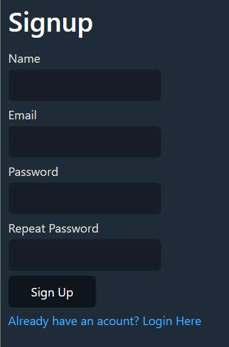

# PROJECT FEATURES:
* Login with valid mail
* Signup with valid info
* Logout
* Send Password reset link to mail-id
* Redirection between pages
* Responsive design for mobile devices

# Important tools used
## To make SignUp more user friendly: JustValidate
It is a moder form validation library which is simple, powerful and lightweight (~5kb gzip). Written in Typescript, and has no dependencies (no JQuery!)  

**with npm:**
``` npm install just-validate --save ```
**with cdn:**
Include JustValidate script on your page from CDN and call it as window.JustValidate
``` <script src="https://unpkg.com/just-validate@latest/dist/just-validate.production.min.js"></script> ```

**VISIT THEM AT:** [JustValidate](https://just-validate.dev/) 


## Classless Css used: Water.css
Water.css is a drop-in collection of CSS styles to make simple websites like this just a little bit nicer.

Now you can write your simple static site with nice semantic html, and Water.css will manage the styling for you.  

Honestly, this is a game changer... saves a lot of time in styling.

To add it to your html:
```<link rel="stylesheet" href="https://cdn.jsdelivr.net/npm/water.css@2/out/water.css">```

**VISIT THEM AT:** [Water.css](https://www.youtube.com/redirect?event=video_description&redir_token=QUFFLUhqbGJadm1UN3JibFZDZWJoMHpnU05WbEZxS09zZ3xBQ3Jtc0trYUxOSWo1eXFrc0FCNldmTHZjcHhNWXFCU05XQmdhWEhkUHZkaUMta1N2NGlSNzBMejNYLXlOaHhNSm9vX3FLUGg1LUN4S0p2cHpXTWNOSzBRb1V6STY5MEZaNlFwcFJSWGxWSUlpZnlrWHZjaW5RSQ&q=https%3A%2F%2Fwatercss.kognise.dev%2F&v=5L9UhOnuos0)

## Sending an email from PHP: SMTP Server + PHPMailer
### What is an SMTP Server?
Just like a web server serves websites, an SMTP Server sends emails. You can either install one SMTP Server locally or use many of the hundreds of links available online. You can also use Gmail's default SMTP server to send emails if you like. But for Gmail based SMTP you might have to configure your gmail account to allow script access. To know more about Gmail's SMTP visit [Official Info](https://www.youtube.com/redirect?event=video_description&redir_token=QUFFLUhqbVlrd0hSaU9VT0g4MmctQTVjVVpJX1VfZGxkZ3xBQ3Jtc0tuMnRVS0JMWlRSUmN3bUdDeGUwSlJVVjk2VGRuSEZxQ2IyN1VEeG9BT1ZwM05ULTdpcGNKRG15QlhLczVEZTFEbm4xUHN1ekxSNFVuUkVnLVMxd21TcjAwN1hPaWxBRlR6T0xoc2ZoWFBhdEF3Wktaaw&q=https%3A%2F%2Fsupport.google.com%2Fa%2Fanswer%2F176600%3Fhl%3Den%23zippy%3D%252Cuse-the-gmail-smtp-server&v=fIYyemqKR58)


**VISIT PHPMailer AT:** [PHPMailer](https://phpmailer.github.io/PHPMailer/files/src-phpmailer.html) 


# GLIMPSE:




## note that no focus has been put to the UI of the project